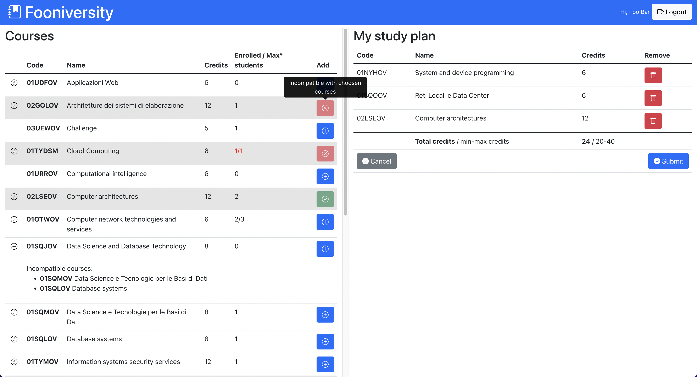

# Exam #1: "StudyPlan"
## Student: s294889 CAVENATI MARCO 

## React Client Application Routes

- Route `/courses`: Shows a table containing all the courses offered by the university.
- Route `/login` : Shows a form where the user can insert username and password to authenticate herself.
- Route `/studyPlan`: Shows a table containing all the courses offered by the university and allows the (authenticated) user to create, read, update, delete her study plan showing alternatively a form for the study plan part-time/full-time choice or a table for the editing of the courses of the study plan.

## API Server

- GET `/api/v1/courses`

    Get all the courses offered by the university.

    **Sample request:** get /api/v1/courses

    **Sample response:** 200 OK
    ```
    [
      {
        "code":"02GOLOV",
        "name":"Architetture dei sistemi di elaborazione",
        "credits":12,
        "maxStudents":null,
        "preparatoryCourse":null,
        "students":1,
        "incompatibleCourses":["02LSEOV"]
      },
      {
        "code":"02LSEOV",
        "name":"Computer architectures",
        "credits":12,
        "maxStudents":null,
        "preparatoryCourse":null,
        "students":0,
        "incompatibleCourses":["02GOLOV"]
      },
      {
        "code":"01TYDSM",
        "name":"Cloud Computing",
        "credits":6,
        "maxStudents":1,
        "preparatoryCourse":"01SQOOV",
        "students":1,
        "incompatibleCourses":[]
      },
      ...
    ]
    ```
    **Other responses:** 500 Internal Server Error

- GET `/api/v1/studyPlans/:studentId`

    Get the study plan of the user.

    **Sample request:** get /api/v1/studyPlans/1 (+ authentication header)

    **Sample response:** 200 OK
    ```
    {
        "isPartTime": true,
        "courses": [ '02GOLOV', '01SQLOV', '02LSEOV' ]
    }
    ```

    **Other responses:** 401 Unauthorized, 403 Forbidden, 404 Not Found, 500 Internal Server Error

- POST `/api/v1/studyPlans`

    Add a study plan for the logged in student.

    **Sample request:** post /api/v1/studyPlans  (+ authentication header)
    ```
    {
        "isPartTime": true,
        "courses": [ '02GOLOV', '01SQLOV', '02LSEOV' ]
    }
    ```

    **Sample response:** 201 Created

    **Other responses:** 401 Unauthorized, 409 Conflict, 422 Unprocessable Entity, 500 Internal Server Error

- PUT `/api/v1/studyPlans/:studentId`

    Replace the study plan of the student.

    **Sample request:** put /api/v1/studyPlans/1 (+ authentication header)
    ```
    {
        "isPartTime": false,
        "courses": [ '02GOLOV', '01SQLOV', '02LSEOV' ]
    }
    ```

    **Sample response:** 200 OK

    **Other responses:** 401 Unauthorized, 403 Forbidden, 404 Not Found, 422 Unprocessable Entity, 500 Internal Server Error

- DELETE `/api/v1/studyPlans/:studentId`

    Delete the study plan of the student.

    **Sample request:** delete /api/v1/studyPlans/1 (+ authentication header)

    **Sample response:** 204 No Content

    **Other responses:** 401 Unauthorized, 403 Forbidden, 500 Internal Server Error

- POST `/api/v1/sessions`

    Perform the login.

    **Sample request:** post /api/v1/sessions
    ```
    {
        "username": "s123456@studenti.polito.it",
        "password": "password"
    }
    ```

    **Sample response:** 201 Created
    ```
    {
        "id":2,
        "username":"marco.cavenati@studenti.polito.it",
        "name":"Marco Cavenati"
    }
    ```

    **Other responses:** 401 Unauthorized, 422 Unprocessable Entity, 500 Internal Server Error

- GET `/api/v1/sessions/current`

    Get the currently logged in user.

    **Sample request:** get /api/v1/sessions/current (+ authentication header)

    **Sample response:** 200 OK
    ```
    {
        "id":2,
        "username":"marco.cavenati@studenti.polito.it",
        "name":"Marco Cavenati"
    }
    ```

    **Other responses:** 401 Unauthorized

- DELETE `/api/v1/sessions/:studentId`

    Perform the logout.

    **Sample request:** delete /api/v1/sessions/1 (+ authentication header)

    **Sample response:** 205 Reset Content

    **Other responses:** 401 Unauthorized, 403 Forbidden, 500 Internal Server Error


## Database Tables

- Table `course` contains data about courses: `code, name, credits, maxStudents, preparatoryCourse`
- Table `incompatibility` contains the incompatibilities between courses.
- Table `student` contains data about the application users and the study plan part-time or full-time option, if they have one: `id, email, (password) hash, (password) salt, isPartTime, name`
- Table `studyPlan` contains the bindings between students and courses, in other words the study plan entries: `studentId, courseCode`

## Main React Components

- `App` (in `App.js`): Holds and manage application state and define routes.
- `MainPage` (in `components/mainComponents.js`): Container for navbar and tables, a graphic layout component.
- `CoursesTable` (in `components/coursesTableComponents.js`): Table showing the courses
- `CourseRow` (in `components/coursesTableComponents.js`): Row of the `CoursesTable`, contains course info and, if in edit mode, a `CourseRowButton` to add the course to the studyPlan
- `CourseDetails` (in `components/coursesTableComponents.js`): When a `CourseRow` is expanded, this table row is shown under the realtive `CourseRow`. It shows course's preparatory and incomplatible courses.
- `LoginPage` (in `components/loginComponents.js`): Container for the login form, a graphic layout component.
- `LoginForm` (in `components/loginComponents.js`): Login form with email and password textboxes and a login button.
- `StudyPlanView` (in `components/studyPlanComponents.js`): Mainly a graphic layout component, shows alternatively a `CreateStudyPlanForm` or a `StudyPlanTable` if a study plan exists.
- `StudyPlanTable` (in `components/studyPlanComponents.js`): Table showing the study plan, in the footer shows alternatively a button for deleteing the study plan and one for editing it (`StudyPlanFooterButtons`) or, if in edit mode, a button to submit the changes or cancel them (`StudyPlanFooterEditButtons`).
- `StudyPlanRow` (in `components/studyPlanComponents.js`): Row of the `StudyPlanTable`, contains course info and, if in edit mode, a button to remove the course from the studyPlan.
- `CreateStudyPlanForm` (in `components/studyPlanComponents.js`): Allows the user to choose a part-time or full-time study plan.
- `StudyPlanNavbar` (in `components/studyPlanNavbar.js`): Application navbar, contains a button for the login or logout.

## Screenshot



## Users Credentials

- marco.cavenati@studenti.polito.it, `🤐`, full time study plan
- john.doe@polito.it, `password`, part time study plan
- s000000@studenti.polito.it, `password`, part time study plan
- foo@bar.com, `password`, no study plan
- s123456@studenti.polito.it, `password`, no study plan
- test@email.com, `password`, no study plan
